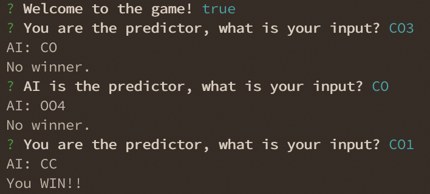
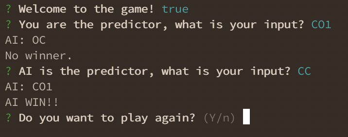

# Open-closed-game
[](https://circleci.com/gh/thestrayed/open-closed-game) [](https://coveralls.io/github/thestrayed/open-closed-game?branch=master)

This is another simple yet fun coding challenge. Here is a [link](https://www.thoughtworks.com/codingchallenge_th) to original website.

## About project

### Game rules

This is console application that takes input from user and returns result whether you win or not. You can either be player or predictor.

Predictor answer will need to contain your hands status and your prediction.

```
CO1
```

That can be interpreted as followings:

- Your left hand is in `closed` status (C)

- Your right hand is in `open` status (O)

- Your prediction is `1` meaning that if sum of open hands between player and predictor equals to `1`, predictor will win

Player answer will only need to contain your hands status.

```
OO
```

That can be interpreted as followings:

- Your left hand is in `open` status (O)

- Your right hand is in `open` status (O)

### Application design

Majority of the game logic is in [/src/lib/game.ts](src/lib/game.ts).
There are 4 functions in that class.

```typescript
begin(playerAnswer: string, predictor?: boolean): boolean;
```
`begin` function is the main function which is being called. It takes player answer and predictor status from console.

```typescript
decide(playerAnswer: string, predictorAnswer: string): boolean;
```
`decide` function is the function that decide whether some win in this round or not. It takes player answer and predictor answer as arguments. Either player or predictor answer is generated randomly.

```typescript
getRandomAnswerForPredictor(predictor: boolean): string;
```
`getRandomAnswerForPredictor` function is the function that return random answer. It takes predictor status whehter this is for predictor or not.

```typescript
getRandomHands(): string;
```
`getRandomHands` function is the function that return random hands.

```typescript
getRandomNumber(min?: number, max?: number): number;
```
`getRandomNumber` function is the function that return randome number between range of min and max. It takes min number and max number.

## Screenshots





## Getting started

### Installation

1. Clone project

1. Install project's dependencies

    ```bash
    yarn
    ```

### Build project

1. Build `dist` folder

    ```bash
    yarn build
    ```

1. Run console application

    ```bash
    node dist/index.js
    ```

### Test

1. Running follow command to execute test

    ```bash
    yarn test
    ```


## Room for improvement

1. Add test with `inquirer` (the console application itself)

1. Support more than just player vs AI

